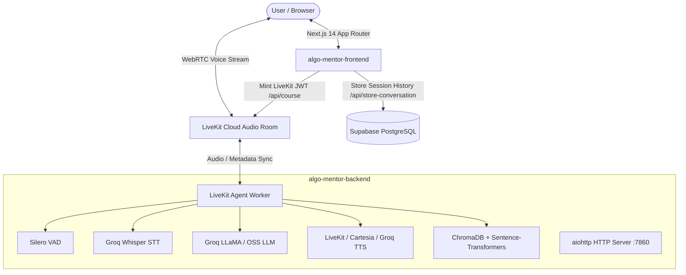

<div align="center">

# 🎓 AlgoMentor

**Voice-first Data Structures & Algorithms (DSA) tutoring platform for developers and college students.**

Talk through LeetCode and technical interview problems out loud with an AI mentor grounded in curated curriculum material using low-latency WebRTC streaming, Socratic guidance, and vector-backed RAG.

[](https://nextjs.org/)
[](https://www.python.org/)
[](https://livekit.io/)
[](https://groq.com/)
[](https://www.trychroma.com/)
[](https://supabase.com/)
[](LICENSE)

</div>

---

## 📑 Table of Contents

- [Overview](#-overview)
- [Key Features](#-key-features)
- [System Architecture](#-system-architecture)
- [Repository Structure](#-repository-structure)
- [Curated DSA Modules (RAG Grounding)](#-curated-dsa-modules-rag-grounding)
- [Environment Variables](#-environment-variables)
  - [Frontend (`algo-mentor-frontend/.env.local`)](#frontend-algo-mentor-frontendenvlocal)
  - [Backend Agent (`algo-mentor-backend/.env`)](#backend-agent-algo-mentor-backendenv)
- [Local Development Setup](#-local-development-setup)
  - [1. Database Setup (Supabase)](#1-database-setup-supabase)
  - [2. Backend Setup (Python & LiveKit Worker)](#2-backend-setup-python--livekit-worker)
  - [3. Frontend Setup (Next.js 14)](#3-frontend-setup-nextjs-14)
- [Docker & Containerized Deployment](#-docker--containerized-deployment)
  - [Running Backend with Docker Compose](#running-backend-with-docker-compose)
  - [Deploying Backend via Render](#deploying-backend-via-render)
  - [Production Frontend Deployment (Vercel)](#production-frontend-deployment-vercel)
- [Health Monitoring & Keep-Alive](#-health-monitoring--keep-alive)
- [Adding New DSA Topics](#-adding-new-dsa-topics)
- [License](#-license)

---

## 💡 Overview

Preparing for technical interviews by typing out code in silence doesn't prepare candidates for real interview conditions, where engineers are expected to talk through their thought process, explore edge cases, and justify algorithmic complexity out loud.

**AlgoMentor** bridges this gap:
- **Interactive Pair Programming**: You speak into your microphone, and AlgoMentor responds verbally in sub-second latency.
- **Socratic Guidance**: Rather than immediately leaking solutions or generating code dumps, AlgoMentor guides you with intuition questions, small numerical examples, and targeted hints.
- **Strictly Grounded (RAG)**: Topic-specific lessons are pulled directly from curated markdown guides via ChromaDB vector retrieval, ensuring the mentor teaches established templates, edge-case pitfalls (like integer overflow in binary search), and optimal bounds.
- **Session Archival**: Chat transcripts and spoken messages are synchronized and saved to Supabase for later review.

---

## ✨ Key Features

- **🎙️ Real-Time Bi-Directional Audio**: Built on LiveKit WebRTC with Silero Voice Activity Detection (VAD) and Groq Whisper STT (`whisper-large-v3-turbo`).
- **⚡ Ultra-Fast Voice Generation**: Supports LiveKit Cloud inference, Groq TTS, and Cartesia Sonic for ultra-realistic spoken conversation with minimal latency.
- **🧠 Semantic Vector Search (RAG)**: Markdown-based course repository indexed with `sentence-transformers/all-MiniLM-L6-v2` and ChromaDB.
- **📝 Live LiveKit Captions & Chat Log**: Real-time speech transcription UI with interactive audio visualizer and mute/disconnect toggles.
- **🎯 Two Learning Modes**:
  - **Topic-Focused Mode**: Deep dives into specific algorithms with preloaded grounded context.
  - **Free Practice Mode**: Open-ended DSA discussion across any coding question or conceptual topic.
- **💾 Session Persistence**: Client-side transcripts are persisted to Supabase upon completing a session (`POST /api/store-conversation`).
- **🛡️ Built-in Keep-Alive Server**: Integrated `aiohttp` web server running alongside the agent worker on port `7860` for cloud pinging and zero-downtime hosting.

---

## 🏗️ System Architecture



### Component Breakdown

| Layer | Technology | Role |
|---|---|---|
| **Frontend** | Next.js 14, React 18, Tailwind CSS, `@livekit/components-react` | Renders the dashboard, mints room access tokens, streams audio/captions, and sends conversation history to database. |
| **Backend Agent** | Python 3.12, `livekit-agents` 1.5, `chromadb`, `sentence-transformers` | Subscribes to the LiveKit voice room, performs speech recognition, queries vector embeddings, runs Socratic LLM prompting, and streams speech back. |
| **Voice Transport** | LiveKit Cloud | Global low-latency WebRTC mesh network routing media tracks between the browser and agent worker. |
| **Inference Engines** | Groq (Whisper STT + LLaMA 3.1 / GPT-OSS) & Cartesia / LiveKit TTS | Hardware-accelerated speech-to-text, fast token generation, and natural speech synthesis. |
| **Vector Database** | ChromaDB (Local Persistent Storage) | Stores chunked vector embeddings of DSA topics with cosine similarity search. |
| **Relational Database** | Supabase (PostgreSQL) | Stores completed interview sessions, message roles, topic IDs, and timestamps. |

---

## 📂 Repository Structure

```text
AlgoMentor/
├── README.md                           # Root documentation & architecture overview
├── supabase/
│   └── schema.sql                      # Supabase SQL schema & Row Level Security policies
│
├── algo-mentor-backend/                # Python LiveKit agent & RAG engine
│   ├── main.py                         # Worker entrypoint, session loop, and aiohttp keep-alive
│   ├── prompts.py                      # Socratic system prompts & dynamic RAG injection logic
│   ├── rag_manager.py                  # ChromaDB interface, chunking logic & embedded fallbacks
│   ├── build_index.py                  # Standalone CLI script to index markdown materials
│   ├── course_material/                # Curated Markdown study materials
│   │   ├── binary-search.md
│   │   ├── dynamic-programming.md
│   │   ├── graphs.md
│   │   ├── linked-lists.md
│   │   ├── trees.md
│   │   └── two-pointers.md
│   ├── rag_storage/                    # ChromaDB vector store directory (auto-created)
│   ├── Dockerfile                      # Container definition for backend agent
│   ├── docker-compose.yml              # Local container orchestration
│   ├── render.yaml                     # Render infrastructure-as-code deployment blueprint
│   ├── requirements.txt                # Python package dependencies
│   ├── .env.example                    # Sample backend environment variables
│   └── .dockerignore
│
└── algo-mentor-frontend/               # Next.js 14 frontend web application
    ├── src/
    │   ├── app/
    │   │   ├── page.tsx                # Root redirect to /course
    │   │   ├── layout.tsx              # Root HTML wrapper and global styles
    │   │   ├── globals.css             # Tailwind & base CSS definitions
    │   │   ├── course/                 # Topic selection view
    │   │   │   ├── page.tsx            # Topic catalog page
    │   │   │   └── [courseId]/page.tsx # Active topic voice session view
    │   │   ├── practice/page.tsx       # Free practice voice session view
    │   │   └── api/
    │   │       ├── course/route.ts     # Mints LiveKit session token with topic metadata
    │   │       ├── token/route.ts      # LiveKit room token endpoint
    │   │       └── store-conversation/ # Persists session transcripts to Supabase
    │   ├── components/
    │   │   ├── ActiveRoom.tsx          # Real-time room controls, visualizer, mic toggles
    │   │   ├── ConversationHistory.tsx # Live streaming transcript feed & speech bubbles
    │   │   ├── VoiceAITutor.tsx        # LiveKit room provider wrapper & lifecycle manager
    │   │   ├── CourseCard.tsx          # Topic card display
    │   │   ├── TopicThumbnail.tsx      # Algorithmic topic visual icons
    │   │   ├── Header.tsx              # Application navigation header
    │   │   └── SessionShell.tsx        # Container layout for sessions
    │   ├── lib/
    │   │   ├── topics.ts               # Course list and topic metadata definitions
    │   │   ├── types.ts                # TypeScript type definitions
    │   │   ├── hooks/                  # Live transcript and participant hooks
    │   │   └── server/livekit-token.ts # LiveKit server SDK token minting utility
    │   └── styles/
    │       └── activeRoom.css          # Pulsing microphone & visualizer animations
    ├── Dockerfile                      # Production Next.js container definition
    ├── package.json                    # Node dependencies & build scripts
    ├── tsconfig.json                   # TypeScript configuration
    └── tailwind.config.ts              # Tailwind design tokens
```

---

## 📚 Curated DSA Modules (RAG Grounding)

The knowledge base in [`algo-mentor-backend/course_material/`](algo-mentor-backend/course_material/) contains comprehensive guides structured with frontmatter metadata:

| Topic | Difficulty | Key Concepts & Patterns Covered | Top Problems |
|---|---|---|---|
| **Binary Search** | Beginner | Monotonic search spaces, integer overflow prevention (`left + (right - left) // 2`), boundary conditions. | *Search in Rotated Sorted Array*, *First/Last Position*, *Ship Capacity* |
| **Linked Lists** | Beginner | Two-pointer (fast & slow) traversal, cycle detection (Floyd's algorithm), in-place node reversal, dummy heads. | *Reverse Linked List*, *Linked List Cycle*, *Merge Two Sorted Lists* |
| **Trees & BST** | Intermediate | Recursive traversals (pre/in/post-order), BFS level-order, BST search/validation properties, tree height/depth. | *Maximum Depth of Binary Tree*, *Invert Binary Tree*, *Validate BST* |
| **Two Pointers** | Beginner | Left/right opposite ends, same-direction sliding windows, duplicate filtering, pair-sum checks. | *Two Sum II (Sorted)*, *3Sum*, *Container With Most Water* |
| **Graphs BFS/DFS** | Intermediate | Adjacency lists/matrices, cycle detection, topological sorting, connected components, shortest paths. | *Number of Islands*, *Course Schedule*, *Clone Graph* |
| **Dynamic Programming** | Advanced | Optimal substructure, overlapping subproblems, top-down memoization vs. bottom-up tabulation, state transitions. | *Climbing Stairs*, *Coin Change*, *Longest Increasing Subsequence* |

Each topic document includes an overview, intuition, code templates (Python), edge cases & pitfalls, complexity analysis, and top interview questions.

---

## 🔑 Environment Variables

### Frontend (`algo-mentor-frontend/.env.local`)

Copy `algo-mentor-frontend/.env.local.example` or create `.env.local`:

```env
# LiveKit Cloud credentials (must match backend project)
LIVEKIT_URL=wss://<your-project>.livekit.cloud
LIVEKIT_API_KEY=your_livekit_api_key
LIVEKIT_API_SECRET=your_livekit_api_secret

# Supabase Configuration (supports any of the naming conventions below)
NEXT_PUBLIC_SUPABASE_URL=https://<your-project-id>.supabase.co
NEXT_PUBLIC_SUPABASE_PUBLISHABLE_KEY=your_supabase_publishable_or_anon_key

# Optional server-side overrides:
# SUPABASE_URL=https://<your-project-id>.supabase.co
# SUPABASE_SERVICE_ROLE_KEY=your_supabase_service_role_key
```

### Backend Agent (`algo-mentor-backend/.env`)

Copy `algo-mentor-backend/.env.example` to `algo-mentor-backend/.env`:

```env
# LiveKit Cloud credentials (must match frontend)
LIVEKIT_URL=wss://<your-project>.livekit.cloud
LIVEKIT_API_KEY=your_livekit_api_key
LIVEKIT_API_SECRET=your_livekit_api_secret

# LLM & Voice Providers
GROQ_API_KEY=gsk_your_groq_api_key
CARTESIA_API_KEY=your_cartesia_api_key   # Required if TTS_PROVIDER is set to cartesia

# Voice & Model Configuration
TTS_PROVIDER=livekit                     # Options: "livekit" (default), "groq", or "cartesia"
GROQ_LLM_MODEL=openai/gpt-oss-20b        # or "llama-3.1-8b-instant"
GROQ_LLM_MAX_TOKENS=120
GROQ_LLM_TEMPERATURE=0.6
GROQ_STT_MODEL=whisper-large-v3-turbo

# VAD & Turn Delays (in seconds)
TURN_MIN_DELAY=0.3
TURN_MAX_DELAY=1.0
SILERO_SAMPLE_RATE=16000
SILERO_MIN_SILENCE=0.4
SILERO_MIN_SPEECH=0.05

# Worker Process Tuning
NUM_IDLE_PROCESSES=1
MEMORY_WARN_MB=800.0

# HTTP Keep-Alive / Healthcheck Server Port
PORT=7860
LIVEKIT_AGENT_PORT=7861
```

---

## 💻 Local Development Setup

### Prerequisites
- **Node.js** 18.x or 20.x
- **Python** 3.10, 3.11, or 3.12
- **LiveKit Cloud Account**: Create a free project at [cloud.livekit.io](https://cloud.livekit.io)
- **Groq API Key**: Obtain from [console.groq.com](https://console.groq.com)
- **Supabase Project**: Free database at [supabase.com](https://supabase.com)

---

### 1. Database Setup (Supabase)

1. Open your Supabase Dashboard and go to the **SQL Editor**.
2. Run the migration script in [`supabase/schema.sql`](supabase/schema.sql):

```sql
create table if not exists conversations (
  id uuid primary key default gen_random_uuid(),
  topic_id text not null,
  session_day int default 1,
  messages jsonb not null,
  created_at timestamptz default now()
);

create index if not exists idx_conversations_topic_created
  on conversations (topic_id, created_at desc);

alter table conversations enable row level security;

create policy "Allow insert for authenticated and anon"
  on conversations for insert
  with check (true);
```

---

### 2. Backend Setup (Python & LiveKit Worker)

Open a terminal in the project root:

```bash
cd algo-mentor-backend

# Create virtual environment
python -m venv .venv

# Activate virtual environment
# On Linux / macOS:
source .venv/bin/activate
# On Windows (PowerShell):
.venv\Scripts\Activate.ps1

# Install dependencies
pip install -r requirements.txt

# Configure environment variables
cp .env.example .env    # edit .env with your credentials

# (Optional) Build or refresh vector index from course_material/
python build_index.py

# Start the LiveKit Agent Worker & Keep-Alive HTTP server
python main.py dev
```

> **Note**: `main.py` automatically initializes and checks the ChromaDB vector database index on startup.

---

### 3. Frontend Setup (Next.js 14)

Open a second terminal window:

```bash
cd algo-mentor-frontend

# Install dependencies
npm install

# Configure environment variables
cp .env.example .env.local    # edit .env.local with your LiveKit & Supabase keys

# Start development server
npm run dev
```

Visit **[http://localhost:3000](http://localhost:3000)** in your browser.
- Browse the topic list at `/course`.
- Choose any topic (e.g. *Binary Search*, *Linked Lists*) or select *Free Practice*.
- Click to allow microphone access, speak to AlgoMentor, and verify bi-directional voice responses and real-time transcripts.

---

## 🐳 Docker & Containerized Deployment

### Running Backend with Docker Compose

The backend includes a preconfigured `docker-compose.yml` with health checks and persistent volume mounting for the ChromaDB vector cache:

```bash
cd algo-mentor-backend

# Start the containerized agent
docker compose up --build -d

# Check logs
docker compose logs -f

# Verify health status
curl http://localhost:7860/health
```

### Deploying Backend via Render

A turnkey Blueprint is provided in [`algo-mentor-backend/render.yaml`](algo-mentor-backend/render.yaml):

1. Link your GitHub repository to [Render](https://render.com).
2. Create a **New Blueprint Instance** pointing to `algo-mentor-backend/render.yaml`.
3. Set your secret environment variables (`LIVEKIT_URL`, `LIVEKIT_API_KEY`, `LIVEKIT_API_SECRET`, `GROQ_API_KEY`, `CARTESIA_API_KEY`).
4. Render builds the Docker image and hosts the keep-alive health check on port `7860`.

### Production Frontend Deployment (Vercel)

The frontend is optimized for deployment on [Vercel](https://vercel.com):

1. Import the repository on Vercel.
2. Set the **Root Directory** to `algo-mentor-frontend`.
3. Add the environment variables:
   - `LIVEKIT_URL`
   - `LIVEKIT_API_KEY`
   - `LIVEKIT_API_SECRET`
   - `NEXT_PUBLIC_SUPABASE_URL`
   - `NEXT_PUBLIC_SUPABASE_PUBLISHABLE_KEY`
4. Click **Deploy**.

---

## 💓 Health Monitoring & Keep-Alive

The Python backend starts an asynchronous HTTP server on port `7860` in parallel with the LiveKit worker.

### Available Endpoints

| Method | Route | Description | Expected Response |
|---|---|---|---|
| `GET` | `/` | Base root health check | `{"status": "online", "app": "AlgoMentor DSA Voice Mentor"}` |
| `GET` | `/health` | Primary health probe | `{"status": "online", "app": "AlgoMentor DSA Voice Mentor"}` |
| `GET` | `/ping` | Lightweight heartbeat | `{"status": "online", "app": "AlgoMentor DSA Voice Mentor"}` |

### Preventing Cloud Server Sleep (e.g., Render / Hugging Face)

To keep free-tier instances running 24/7 without idle shutdown:
1. Register a free monitor at [UptimeRobot](https://uptimerobot.com) or [Better Stack](https://betterstack.com).
2. Configure an **HTTP(s)** monitor targeting:
   `https://<your-backend-host>/health`
3. Set the interval to **5 minutes**.

---

## ➕ Adding New DSA Topics

Expanding the curriculum is straightforward:

1. **Create Markdown File**: Add `<topic-id>.md` in `algo-mentor-backend/course_material/`:
   ```markdown
   ---
   id: graphs-dijkstra
   title: Dijkstra's Algorithm
   difficulty: intermediate
   category: Shortest Path
   ---

   # Dijkstra's Algorithm Overview
   ...
   ## Key Intuition & Concept
   ...
   ## Code Template (Python)
   ...
   ## Edge Cases & Pitfalls
   ...
   ```
2. **Rebuild Vector Index**:
   ```bash
   cd algo-mentor-backend
   python build_index.py
   ```
3. **Register in Prompts**: Add the topic key to `TOPICS` in [`algo-mentor-backend/prompts.py`](algo-mentor-backend/prompts.py).
4. **Register in Frontend**: Add the topic entry to `TOPICS` in [`algo-mentor-frontend/src/lib/topics.ts`](algo-mentor-frontend/src/lib/topics.ts).

---

## 📄 License

Distributed under the [MIT License](LICENSE). Feel free to adapt, extend, and deploy for your own educational projects.
